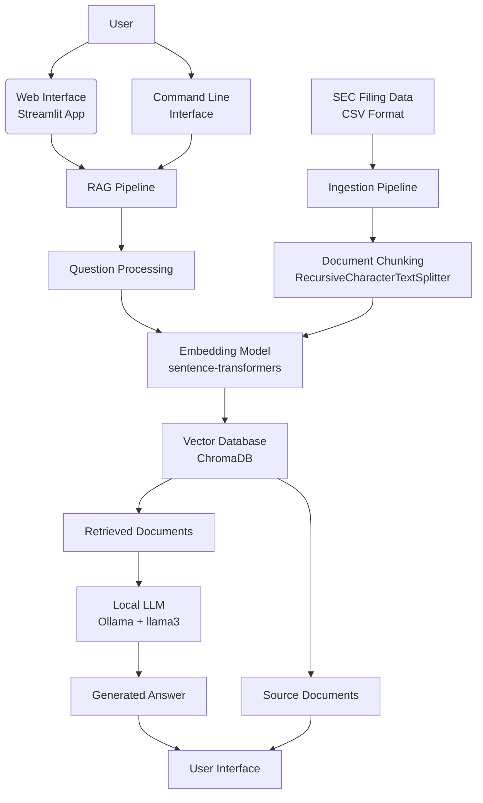

# Project Architecture

```mermaid
graph TD
    A[User] --> B(Web Interface<br/>Streamlit App)
    A --> C[Command Line<br/>Interface]
    B --> D[RAG Pipeline]
    C --> D[RAG Pipeline]
    D --> E[Question Processing]
    E --> F[Embedding Model<br/>sentence-transformers]
    F --> G[Vector Database<br/>ChromaDB]
    G --> H[Retrieved Documents]
    H --> I[Local LLM<br/>Ollama + llama3]
    I --> J[Generated Answer]
    J --> K[User Interface]
    G --> L[Source Documents]
    L --> K
    M[SEC Filing Data<br/>CSV Format] --> N[Ingestion Pipeline]
    N --> O[Document Chunking<br/>RecursiveCharacterTextSplitter]
    O --> F
```